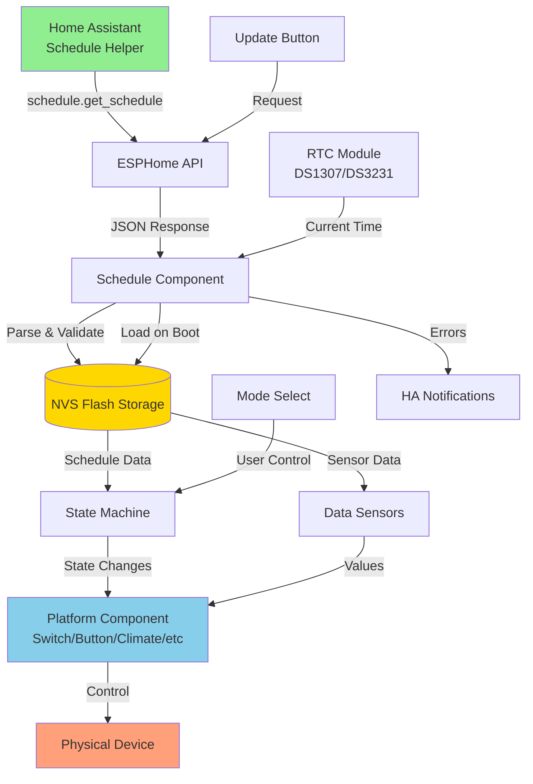
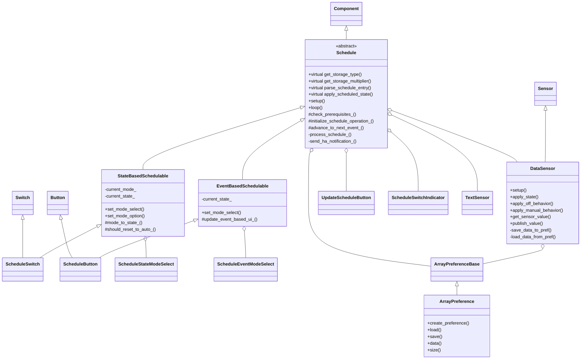
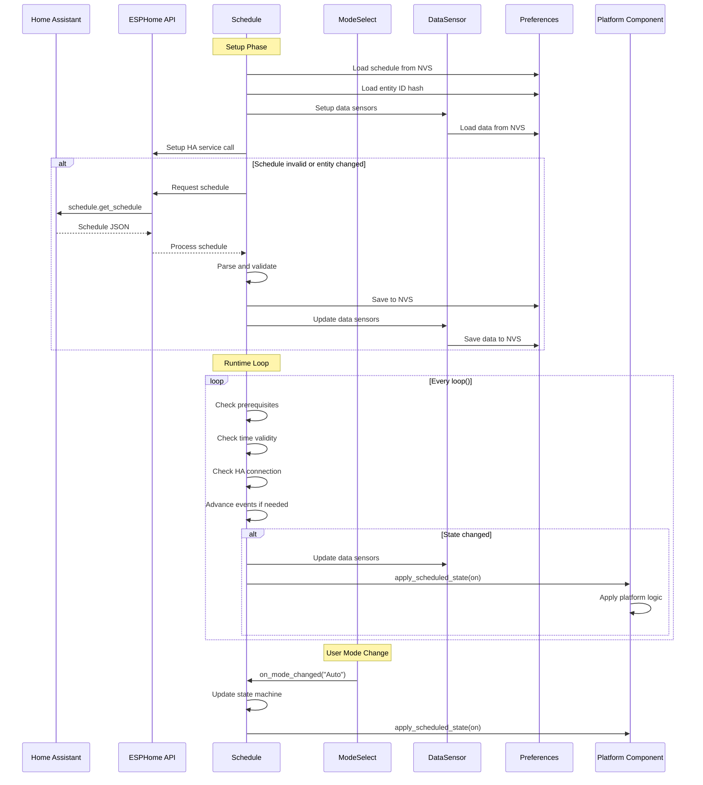
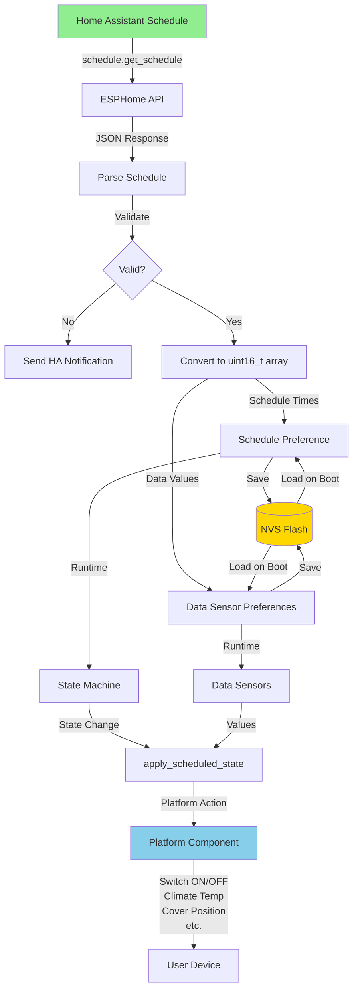
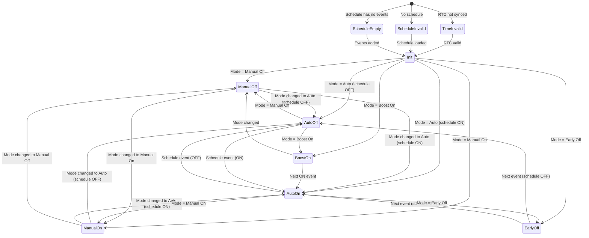
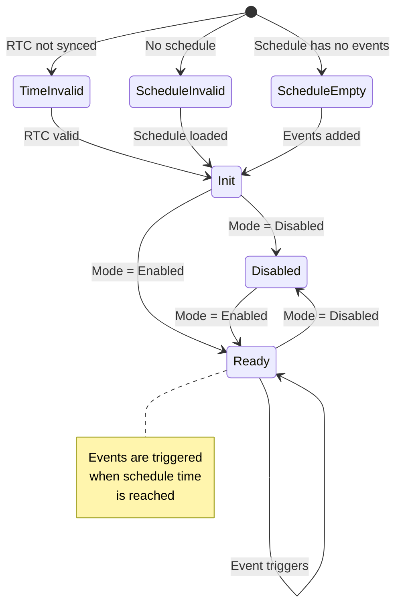
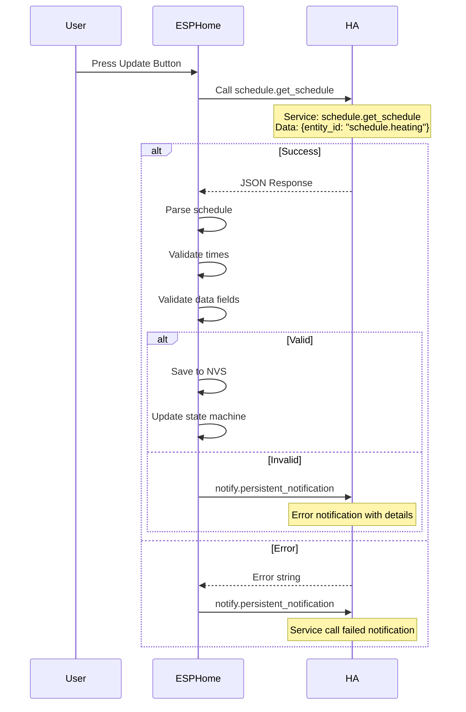

# Schedule Component Architecture

This document provides a comprehensive overview of the ESPHome Schedule component architecture, including class relationships, data flow, and design decisions.

## Table of Contents
- [Overview](#overview)
- [Class Hierarchy](#class-hierarchy)
- [Component Interactions](#component-interactions)
- [Data Flow](#data-flow)
- [State Machines](#state-machines)
- [Storage Architecture](#storage-architecture)
- [Home Assistant Integration](#home-assistant-integration)

---

## Overview

The Schedule component provides time-based automation for ESPHome devices integrated with Home Assistant schedules. It supports two fundamental storage types:

1. **State-Based**: For components that maintain continuous ON/OFF states (Switch, Climate, Light)
2. **Event-Based**: For components that respond to discrete events (Button, Cover, Lock)

### Key Design Principles

- **Extensibility**: Virtual methods allow easy addition of new platforms
- **Efficiency**: Event-based storage uses 50% less memory
- **Persistence**: Schedules stored in NVS flash survive reboots
- **Integration**: Seamless sync with Home Assistant schedules
- **Flexibility**: Data sensors support schedule variables (temperature, position, etc.)

---
## High Level Architecture



---
## Class Diagram

See detailed class hierarchy below.

## Class Hierarchy



### Class Descriptions

#### Schedule (Base Class)
Core component that manages schedule data, Home Assistant integration, and time-based logic.

**Responsibilities:**
- Schedule data storage and retrieval
- HA service call setup and response handling
- Event tracking and advancement
- Preference management
- Error notification to HA

**Key Virtual Methods:**
- `get_storage_type()` - Returns storage type (state/event)
- `get_storage_multiplier()` - Returns 2 for state, 1 for event
- `parse_schedule_entry()` - Parses HA JSON into storage format
- `apply_scheduled_state(bool on)` - Platform-specific state application

#### StateBasedSchedulable
Extends Schedule for components with continuous state.

**Additional Features:**
- 5-mode state machine (Manual Off/On, Auto, Early Off, Boost On)
- Automatic mode transitions
- State persistence

#### EventBasedSchedulable
Extends Schedule for event-triggered components.

**Additional Features:**
- 2-mode operation (Disabled, Enabled)
- Event-only triggering
- 50% storage savings

#### DataSensor
Manages schedule variables (temperature, position, etc.).

**Features:**
- Type-safe storage (uint8_t, uint16_t, int32_t, float)
- OFF behavior modes (NAN, LAST_ON_VALUE, OFF_VALUE)
- Manual behavior modes
- Persistent storage per sensor

---

## Component Interactions



### Interaction Flow

1. **Setup:**
   - Load schedules from NVS
   - Check if entity ID changed
   - Request schedule from HA if needed
   - Initialize state machine

2. **Runtime:**
   - Check prerequisites (time, HA connection, schedule validity)
   - Advance events when time reached
   - Update data sensors
   - Apply state to platform component

3. **User Interaction:**
   - Mode changes update state machine
   - Update button triggers HA schedule request
   - Manual control can override schedule

---

## Data Flow



### Data Transformation Pipeline

1. **Home Assistant → ESPHome**
   ```
   HA Schedule (JSON) → API Service Call → Parse/Validate → uint16_t Array
   ```

2. **Storage Encoding**
   
   **State-Based:**
   ```
   [ON_TIME | STATE_BIT, OFF_TIME | STATE_BIT, ..., 0xFFFF, 0xFFFF]
   Bits 0-13: Time in minutes from Monday 00:00
   Bit 14: Switch state (1=ON, 0=OFF)
   ```
   
   **Event-Based:**
   ```
   [EVENT_TIME | STATE_BIT, ..., 0xFFFF, 0xFFFF]
   Bits 0-13: Time in minutes from Monday 00:00
   Bit 14: Always 1 (event trigger)
   ```

3. **Data Sensors**
   ```
   JSON "data" field → Type conversion → Byte array → NVS
   Types: uint8_t (1 byte), uint16_t (2 bytes), int32_t (4 bytes), float (4 bytes)
   ```

---

## State Machines

### State-Based State Machine



### Event-Based State Machine



---

## Storage Architecture

### NVS Memory Layout

```
┌──────────────────────────────────────────────┐
│         Schedule Preference                  │
│  Key: hash(object_id)                        │
│  Size: (entries × multiplier × 2) + 4 bytes  │
│                                              │
│  State-based: [ON, OFF, ON, OFF, ..., TERM]  │
│  Event-based: [EVT, EVT, EVT, ..., TERM]     │
└──────────────────────────────────────────────┘

┌──────────────────────────────────────────────┐
│         Data Sensor Preference (per sensor)  │
│  Key: hash(sensor_object_id)                 │
│  Size: entries × type_size bytes             │
│                                              │
│  [value1, value2, value3, ...]               │
└──────────────────────────────────────────────┘

┌──────────────────────────────────────────────┐
│         Entity ID Hash                       │
│  Key: hash("entity_id") ^ hash(object_id)    │
│  Size: 4 bytes                               │
│                                              │
│  Used to detect schedule entity changes      │
└──────────────────────────────────────────────┘

┌──────────────────────────────────────────────┐
│         Mode Select Index                    │
│  Key: hash(mode_select_object_id)            │
│  Size: 1 byte                                │
│                                              │
│  Stores selected mode index                  │
└──────────────────────────────────────────────┘
```

### Storage Size Examples

#### State-Based Switch (21 entries)
```
Schedule:     (21 × 2 × 2) + 4 = 88 bytes
Temperature:  (21 × 4)         = 84 bytes (float)
Humidity:     (21 × 4)         = 84 bytes (float)
                           Total = 256 bytes
```

#### Event-Based Button (21 entries)
```
Schedule:     (21 × 1 × 2) + 4 = 46 bytes  (47% savings!)
Position:     (21 × 4)         = 84 bytes (float)
                           Total = 130 bytes (49% savings!)
```

---

## Home Assistant Integration

### Service Call Flow



### Schedule JSON Format

```json
{
  "response": {
    "schedule.heating": {
      "monday": [
        {
          "from": "06:00:00",
          "to": "08:00:00",
          "data": {
            "temperature": 21.0,
            "humidity": 50
          }
        },
        {
          "from": "17:00:00",
          "to": "22:00:00",
          "data": {
            "temperature": 20.5,
            "humidity": 45
          }
        }
      ],
      "tuesday": [...],
      ...
    }
  }
}
```

### Error Notifications

The component sends Home Assistant notifications for:

1. **Schedule Retrieval Failures**
   - Entity not found in response
   - Service call error

2. **Parsing Errors**
   - Day missing from schedule
   - Invalid or missing 'from'/'to' fields
   - Invalid time ranges

3. **Data Issues**
   - Missing data field
   - Incorrect data type (expected int, got string)
   - Unknown item type

4. **Storage Issues**
   - Schedule exceeds max size (with truncation warning)

---

## Dynamic Mode Selection

The mode select components automatically adapt their available options based on the schedule state to prevent user confusion and errors.

### State-Based Mode Behavior

**When Schedule is Empty:**
- Available modes: "Manual Off", "Manual On" only
- Hidden modes: "Auto", "Early Off", "Boost On"
- Rationale: Schedule-dependent modes require valid schedule data to function

**When Schedule is Populated:**
- All 5 modes available: "Manual Off", "Early Off", "Auto", "Manual On", "Boost On"

**Auto-Switching:**
- If current mode is "Auto" when schedule becomes empty  switches to "Manual Off"
- If current mode is "Early Off" or "Boost On" when schedule becomes empty  switches to "Manual Off"

**Implementation:**
- `ScheduleStateModeSelect::set_manual_only_mode(bool is_empty)`
- Called from `StateBasedSchedulable::on_schedule_empty_changed()`
- Uses `SelectTraits::set_options()` to update available options
- Calls `publish_state()` to notify Home Assistant

### Event-Based Mode Behavior

**When Schedule is Empty:**
- Available modes: "Disabled" only
- Hidden modes: "Enabled"
- Rationale: Cannot trigger events without schedule data

**When Schedule is Populated:**
- Both modes available: "Disabled", "Enabled"

**Auto-Switching:**
- If current mode is "Enabled" when schedule becomes empty  switches to "Disabled"

**Implementation:**
- `ScheduleEventModeSelect::set_disabled_only_mode(bool is_empty)`
- Called from `EventBasedSchedulable::on_schedule_empty_changed()`
- Uses `SelectTraits::set_options()` to update available options
- Calls `publish_state()` to notify Home Assistant

### Home Assistant UI Behavior

**Known Limitation:**
- Home Assistant caches select entity options
- UI may not immediately reflect option changes until:
  - Browser page refresh
  - ESPHome device reconnection
  - Home Assistant restart

**Why This Happens:**
- HA queries entity traits on entity discovery/reconnection
- Dynamic trait changes between connections may not trigger immediate UI update
- `publish_state()` notifies HA of state change, but not necessarily trait changes


## Design Decisions

### Why Virtual Methods Instead of Separate Base Class?

**Chosen Approach:**
```cpp
class Schedule {
  virtual ScheduleStorageType get_storage_type() const;
  virtual void parse_schedule_entry(...);
};
```

**Alternative (Not Used):**
```cpp
class SchedulableBase { ... };
class Schedule : public SchedulableBase { ... };
```

**Rationale:**
- Simpler inheritance hierarchy
- Avoids diamond inheritance problem
- Easier to extend for new platforms
- Less code duplication
- Maintains backward compatibility

### Why Two Storage Types?

**State-Based** stores ON/OFF pairs because:
- Switches, Climate, Lights need continuous state
- Must know both when to turn ON and when to turn OFF
- State persists between events

**Event-Based** stores single events because:
- Buttons, Covers, Locks trigger once
- No continuous state to maintain
- Saves 50% storage space

### Why Separate Mode Select Classes?

Different platforms need different modes:
- State-based: Manual Off, Early Off, Auto, Manual On, Boost On
- Event-based: Disabled, Enabled

Separate classes keep implementation clean and user-friendly.

### Why Auto-Generate Component IDs?

**Before:**
```yaml
mode_selector:
  id: heating_mode_select
  name: "Heating Mode"
```

**After:**
```yaml
mode_selector:
  name: "Heating Mode"  # ID auto-generated as {parent_id}_mode_select
```

**Benefits:**
- Less verbose YAML
- Consistent naming
- Prevents ID conflicts
- Users can still override when needed

---

## Extension Points

### Adding New Storage Types

```cpp
enum ScheduleStorageType {
  STORAGE_TYPE_STATE_BASED = 0,
  STORAGE_TYPE_EVENT_BASED = 1,
  STORAGE_TYPE_CUSTOM = 2  // Your custom type
};

class CustomSchedulable : public Schedule {
  ScheduleStorageType get_storage_type() const override {
    return STORAGE_TYPE_CUSTOM;
  }
  
  size_t get_storage_multiplier() const override {
    return 3;  // Custom multiplier
  }
  
  void parse_schedule_entry(...) override {
    // Custom parsing logic
  }
};
```

### Adding New Data Behaviors

Currently supports:
- OFF behavior: NAN, LAST_ON_VALUE, OFF_VALUE
- Manual behavior: NAN, LAST_ON_VALUE, MANUAL_VALUE

To add new behaviors, extend enum and add cases in `DataSensor::apply_*_behavior()`.

---

## Performance Characteristics

### Memory Usage
- Base Schedule: ~200 bytes
- Per Entry (State): 4 bytes
- Per Entry (Event): 2 bytes
- Per Data Sensor: entries × type_size

### CPU Usage
- State machine: Runs every loop() (~20ms)
- Connection check: Every 10 seconds
- Event check: Every minute (verbose logging)
- NVS writes: Only on schedule updates

### Network Usage
- Schedule request: ~1-5KB JSON
- Minimal during runtime (state updates only)

---

## Future Enhancements

### Potential Additions
- [ ] Schedule editing from ESPHome (not just sync from HA)
- [ ] Conditional schedules (if-then logic)
- [ ] Schedule override times (vacation mode)
- [ ] Weekly/monthly patterns

### Compatibility
- Current architecture supports all these without breaking changes
- Virtual methods allow backward-compatible extensions
- NVS storage can be versioned

---

## References

- [QUICK_REFERENCE.md](QUICK_REFERENCE.md) - YAML examples and common tasks
- [ADDING_NEW_PLATFORMS.md](ADDING_NEW_PLATFORMS.md) - Step-by-step platform development
- [ESPHome Documentation](https://esphome.io/) - ESPHome framework
- [Home Assistant Schedules](https://www.home-assistant.io/integrations/schedule/) - HA schedule helper

---

**Last Updated:** January 2026  
**Repository:** [pebblebed-tech/schedule](https://github.com/pebblebed-tech/schedule)

